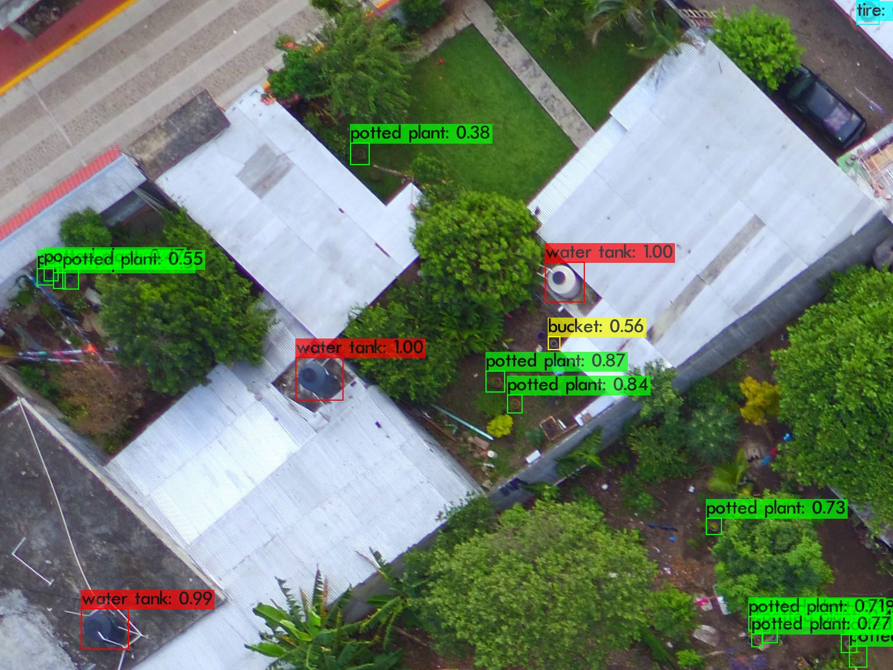

# Mosquito Breeding Site Detection using Deep Learning



---

# 📌 Project Overview

This repository contains the experiments, trained models, configurations, datasets, and results for a deep learning project focused on the detection of potential mosquito breeding sites using computer vision techniques.

Mosquitoes are vectors for several diseases such as dengue, zika, and chikungunya. One of the most important preventive strategies is the identification and elimination of environments where mosquitoes reproduce, especially objects capable of accumulating water.

The main objective of this project is to automatically identify objects and environments that may serve as mosquito breeding grounds from images using Deep Learning and Object Detection models.

This work was developed as part of a Master's Thesis focused on the application of Artificial Intelligence and Computer Vision techniques to environmental monitoring and public health problems.

---

# 🧠 Models Used

Different object detection architectures were trained and evaluated during the development of this project.

The following models were explored:

- YOLOv4 tiny, v4
- YOLOv7 tiny, v7x
- YOLOv8n, v8x
- YOLOv12n, v12x
- Experimental configurations and custom variants

Each model was trained using different hyperparameter configurations and training strategies in order to compare their performance, detection accuracy, and generalization capabilities.

The experiments focused on identifying which architecture provides the best balance between:

- Detection performance
- Precision
- Recall
- Computational efficiency
- Robustness under different environmental conditions

---

# 🗂 Dataset Information

The dataset used in this project consists of annotated images containing objects and environments commonly associated with mosquito breeding due to water accumulation.

The images were manually annotated for object detection tasks using bounding boxes.

## Categories

The following categories were used during training:

- Bucket
- Flower Pot
- Puddle
- Water Tank
- Tire

These categories represent common objects where stagnant water may accumulate and become potential mosquito breeding sites.

The dataset contains images with different:

- Lighting conditions
- Backgrounds
- Object scales
- Camera angles
- Environmental scenarios

This variability was intentionally included to improve the generalization capability of the trained models.

---

# 📂 Repository Structure

```bash
├── best_weights/
├── conf_train/
├── datasets/
├── dir_train_test_val/
├── results/
```

The repository is organized into five main folders, each one corresponding to a different stage of the experimentation pipeline.

---

# 📁 Folder Description

## `best_weights/`

This folder stores the best trained weights obtained during the training process for each model.

During training, multiple checkpoints are generated. However, only the weights corresponding to the best validation performance are saved in this directory.

These files represent the final optimized versions of the trained models and can later be used for:

This folder is especially important because it contains the final models used for evaluation and comparison.

---

## `conf_train/`

This folder contains the configuration files used during model training.

Each experiment may use different training settings, and these configurations are stored here to ensure reproducibility of the experiments.

The configuration files include parameters such as:

- Learning rate
- Number of epochs
- Batch size
- Image size
- Optimizer selection
- Data augmentation settings
- Model architecture parameters
- Training hyperparameters

Keeping these files organized allows researchers to replicate experiments and compare the impact of different configurations on model performance.

---

## `datasets/`

This folder contains information related to the datasets used in the project.

Since the complete image datasets are too large to be uploaded directly to GitHub, this directory includes external links to Google Drive where the datasets are stored.

Inside this folder, users can find:

- Dataset download links where you can find the dataset and annotation resources

The datasets include all annotated images required to reproduce the experiments described in this repository.

---

## `dir_train_test_val/`

This folder contains the `.txt` files used to define the dataset partitions.

These files indicate which images belong to:

- Training set
- Validation set
- Test set

Each file contains the image paths used during each phase of training and evaluation.

This structure ensures:

- Experiment reproducibility
- Consistent dataset splitting
- Proper separation between training and testing data

Maintaining fixed dataset partitions is essential for obtaining fair and comparable evaluation results across different models.

---

## `results/`

This folder contains the results generated during the training and evaluation stages.

The objective of this directory is to provide a complete summary of the performance obtained by each trained model.

Examples of stored outputs include:

- Training curves
- Loss plots
- Precision metrics
- Recall metrics
- mAP results
- Confusion matrices
- Detection visualizations

This folder allows direct comparison between models and helps identify the best-performing architecture for mosquito breeding site detection.

---

# 📈 Evaluation Metrics

The models were evaluated using standard object detection metrics commonly used in Computer Vision tasks.

The evaluation metrics include:

- Precision
- Recall
- F1-Score
- mAP@0.5

These metrics help measure:

- Detection quality
- Localization accuracy
- Classification performance
- Generalization capability

The results obtained from these metrics were used to compare all trained models.

---

# 🛠 Technologies Used

The project was developed using the following technologies and frameworks:

- Python
- PyTorch
- OpenCV
- YOLO Frameworks
- CUDA
- GPU Environments
- NumPy
- Matplotlib

These tools were used for:

- Data preprocessing
- Model training
- Evaluation
- Visualization
- Experiment management

---

# 🎯 Research Objective

The main purpose of this research is to explore the effectiveness of Deep Learning-based object detection models for identifying potential mosquito breeding sites from images.

This project aims to contribute to:

- Automated environmental monitoring
- Disease prevention strategies
- Public health support systems
- Smart vector surveillance solutions

Through the use of Artificial Intelligence and Computer Vision, this work seeks to provide technological tools capable of assisting in the early detection of mosquito breeding environments.

---

# 📂 Project Repository & Data

All resources, source code, and datasets related to this research are hosted and organized in the following Google Drive repository:

* **[Main Drive Repository]** -> [https://drive.google.com/drive/folders/1eUOITTpQMF229F8kdbOlNnEDZ-YdX1h5?usp=sharing]
    * *Description:* Root folder containing all project documentation, notebooks, and model weights.

### 📊 Available Datasets
* **[Dataset 1: El Vergel]** -> [https://drive.google.com/drive/folders/1BGW6mcGzIDbLEf-1sQ6bksKl4XUlFQSk?usp=sharing]
* **[Dataset 2: MBG-V2]** -> [https://drive.google.com/drive/folders/17LDfdm_ks5Oz7ioRU4-aeRsarst1TdA0?usp=sharing]

---

# 📄 Author

**Armando Salinas**  
Master's Thesis Project
